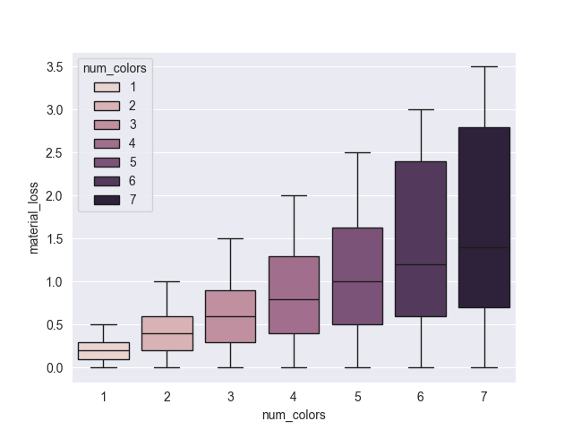
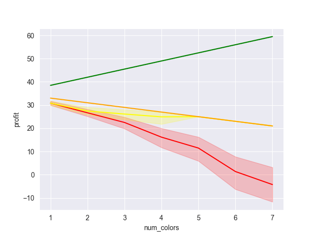

# Original Version
#### Etsy Profitability and Material Loss Study
- The numbers in this study were pulled from a client selling handmade goods on Etsy.
- The details about the orders have been removed form this analysis but the numbers used were real. 
- This project was posted on GitHub with permission from client.

# Etsy Product Profitability and Material Loss Report
This report was used to optimize the pricing and material loss calculations used by a local Etsy store. 
- The numbers in this study were pulled from a client selling handmade goods on Etsy.
- The details about the orders have been removed form this analysis but the numbers used were real. 
- This project was posted on GitHub with permission from client. 

## Features
- Generates synthetic data for test analysis using Panda DataFrames.
- Calculates profit and material loss from order length and width.
- Compares different pricing structure for product and calculates margins for each.
- Generates HTML report for client using Jupyter notebook.

## Findings
### Material Loss vs Num Colors
- As num colors went up material loss went up.
- Material loss did not go up evenly for all orders. 

### Profit Chart
Four pricing structures were suggested in this report.
- Red Line: color surcharge = \$5 with no limits on order dimensions. (Price0)
- Yellow Line: color surcharge = \$5 and material loss < 1 unit (Price2)
- Green Line: color surcharge = \$5 and length + width == 19 (Price3)

#### Final Profit Calculations
- Pricing structure 3 has a mean profit around \$28

## Final Thoughts
- Based on the profit vs num_color plots the optimal price for our products is \$40 per order with a surcharge of \$5 per color.
- Client should remove items with high material loss from the store by limiting product whose length and width add up to 19.

## Frameworks Versions at (09/16/2025)
- python: 3.13
- pandas: 2.3.2
- numpy: 2.3.2
- seaborn: 0.13.2
- jupyterlab: 4.4.7
- jupyter_client: 8.6.3
- jupyter_core: 5.8.1
- jupyter_server: 2.17.0
# Author 
- Product Profitability Report
- Daniel Levenstein
- Date: 09/16/2025